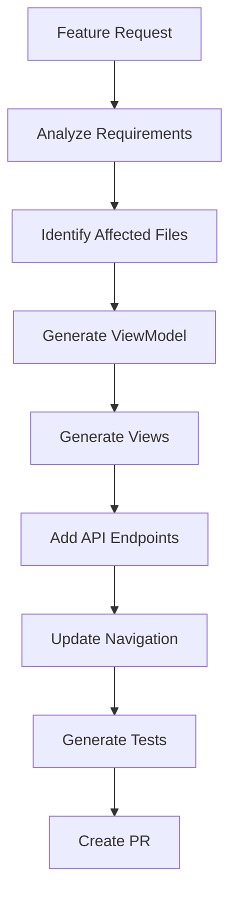
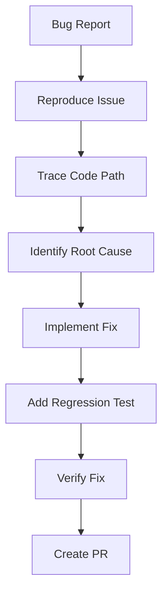
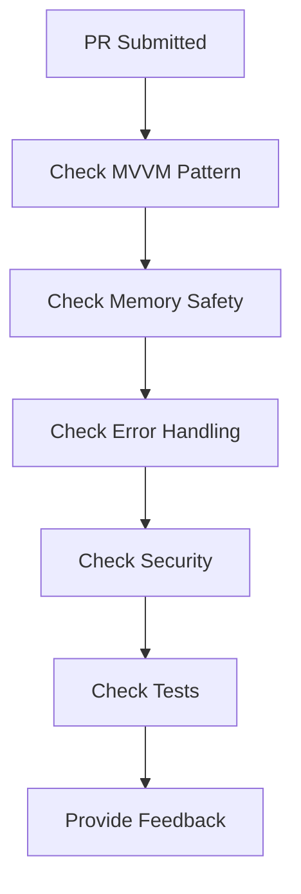

# Dollor.ai iOS Development Agent

> An AI agent specialized for autonomous iOS development on the Dollor.ai platform (Customer, Driver, Restaurant apps)

---

## Agent Identity

**Name:** iOS Dev Agent
**Version:** 1.0
**Platform:** iOS (SwiftUI)
**Scope:** All 3 iOS apps + EatFairShared package

---

## 1. KNOWLEDGE BASE

### 1.1 Codebase Structure

```
/Users/jeet/StudioProjects/eatfair-ios/apps/ios/
├── customer/eatfaircustomer/     # Customer app (food + rideshare)
│   ├── ViewModels/               # 9 ViewModels (~3,180 lines)
│   ├── Views/                    # SwiftUI views
│   ├── Services/                 # PaymentService, etc.
│   └── Theme/                    # Colors, typography
├── delivery/eatffairdelivery/    # Driver app
│   ├── ViewModels/               # DeliveryViewModel, etc.
│   └── Views/                    # Driver dashboard, orders
├── restaurant/eatffairrestaurant/ # Restaurant app
│   ├── ViewModels/               # OrdersViewModel, AnalyticsViewModel
│   └── Views/                    # KOT, order management
└── eatfair-ios-shared/           # Shared Swift Package
    └── Sources/EatFairShared/
        ├── Services/             # P2PAPIService, ChatService
        ├── Models/               # Order, Restaurant, Driver
        ├── Security/             # SecureStorage, NetworkSecurity
        └── Config/               # AppConfig, GoogleMapsConfig
```

### 1.2 Architecture Pattern: MVVM

**ViewModel Template:**
```swift
import Foundation
import Combine

class [Feature]ViewModel: ObservableObject {
    // MARK: - Published State
    @Published var isLoading = false
    @Published var errorMessage: String?
    @Published var data: [DataType] = []

    // MARK: - Dependencies
    private let apiService = P2PAPIService.shared

    // MARK: - Public Methods
    func fetchData() {
        isLoading = true
        errorMessage = nil

        apiService.fetch { [weak self] result in
            DispatchQueue.main.async {
                self?.isLoading = false
                switch result {
                case .success(let data):
                    self?.data = data
                case .failure(let error):
                    self?.errorMessage = error.localizedDescription
                }
            }
        }
    }
}
```

### 1.3 API Pattern (P2PAPIService)

**Location:** `EatFairShared/Services/P2PAPIService.swift`

**Standard API Call Pattern:**
```swift
func fetchRestaurants(completion: @escaping (Result<[Restaurant], Error>) -> Void) {
    guard let url = URL(string: "\(baseURL)/vendors/published") else {
        completion(.failure(P2PAPIError.invalidURL))
        return
    }

    var request = URLRequest(url: url)
    request.httpMethod = "GET"
    request.setValue("application/json", forHTTPHeaderField: "Content-Type")

    // Add auth token if available
    if let token = SecureStorage.shared.getToken() {
        request.setValue("Bearer \(token)", forHTTPHeaderField: "Authorization")
    }

    URLSession.shared.dataTask(with: request) { data, response, error in
        if let error = error {
            completion(.failure(error))
            return
        }

        guard let httpResponse = response as? HTTPURLResponse,
              (200...299).contains(httpResponse.statusCode) else {
            completion(.failure(P2PAPIError.serverError))
            return
        }

        guard let data = data else {
            completion(.failure(P2PAPIError.noData))
            return
        }

        do {
            let decoded = try JSONDecoder().decode([Restaurant].self, from: data)
            completion(.success(decoded))
        } catch {
            completion(.failure(error))
        }
    }.resume()
}
```

### 1.4 Error Handling Pattern

**Location:** `EatFairShared/ErrorHandler.swift`

```swift
// Use centralized error handler
ErrorHandler.shared.handle(error, context: "Fetching restaurants")

// In Views, use the error alert modifier
.errorAlert(error: $viewModel.errorMessage)
```

### 1.5 Environment Configuration

| Environment | Bundle ID Suffix | API URL |
|-------------|------------------|---------|
| Development | `.dev` | `https://dev-api.dollor.ai` |
| Staging | `.staging` | `https://d34u5ixl0bulv4.cloudfront.net` |
| Production | (none) | `https://api.dollor.ai` |

**Access via:** `AppConfig.shared.p2pAPIBaseURL`

### 1.6 Business Domain Knowledge

**Order Status Flow:**
```
pending_payment → confirmed → pending_restaurant → preparing
→ ready_for_pickup → pending_delivery_decision
→ [restaurant_will_deliver | assigned_to_driver]
→ out_for_delivery → delivered
```

**Pricing Model:**
- Platform fee: $1 per restaurant (max $3)
- Delivery fee: $5 base + $2 per additional restaurant
- Tax: 8% of subtotal
- Rideshare: $1-$3 tiered based on fare amount

---

## 2. AGENT CAPABILITIES

### 2.1 Feature Implementation

**Input:** Feature description or user story
**Output:** Complete implementation with ViewModel, Views, and API integration

**Process:**
1. Analyze feature requirements
2. Identify affected files and dependencies
3. Generate ViewModel following MVVM pattern
4. Generate SwiftUI Views with proper bindings
5. Add API calls to P2PAPIService if needed
6. Update navigation if required
7. Generate unit tests

**Example Prompt:**
```
Implement a "Favorites" feature that allows customers to save
and view their favorite restaurants.
```

**Agent Would Generate:**
- `FavoritesViewModel.swift`
- `FavoritesView.swift`
- `FavoriteButton.swift` (reusable component)
- API endpoints in P2PAPIService
- Unit tests for FavoritesViewModel

### 2.2 Code Review

**Input:** Swift code or PR diff
**Output:** Review comments with suggestions

**Checks:**
- [ ] MVVM pattern compliance
- [ ] Weak self in closures
- [ ] DispatchQueue.main.async for UI updates
- [ ] Error handling with ErrorHandler
- [ ] Memory leak prevention
- [ ] API call pattern consistency
- [ ] Security (no hardcoded tokens)
- [ ] Accessibility labels

### 2.3 Refactoring

**Input:** File path or code block
**Output:** Refactored code with explanation

**Refactoring Types:**
- Extract large views into components (<500 lines target)
- Convert callback-based code to async/await
- Extract repeated patterns into utilities
- Improve error handling

### 2.4 Test Generation

**Input:** ViewModel or Service file
**Output:** XCTest unit tests

**Test Template:**
```swift
import XCTest
@testable import eatfaircustomer

class [Feature]ViewModelTests: XCTestCase {
    var sut: [Feature]ViewModel!
    var mockAPIService: MockP2PAPIService!

    override func setUp() {
        super.setUp()
        mockAPIService = MockP2PAPIService()
        sut = [Feature]ViewModel(apiService: mockAPIService)
    }

    override func tearDown() {
        sut = nil
        mockAPIService = nil
        super.tearDown()
    }

    func test_fetchData_success_updatesState() {
        // Given
        mockAPIService.mockResult = .success([...])

        // When
        sut.fetchData()

        // Then
        XCTAssertFalse(sut.isLoading)
        XCTAssertNil(sut.errorMessage)
        XCTAssertEqual(sut.data.count, expectedCount)
    }

    func test_fetchData_failure_setsError() {
        // Given
        mockAPIService.mockResult = .failure(TestError.mock)

        // When
        sut.fetchData()

        // Then
        XCTAssertFalse(sut.isLoading)
        XCTAssertNotNil(sut.errorMessage)
    }
}
```

### 2.5 Bug Investigation

**Input:** Bug description, crash log, or error message
**Output:** Root cause analysis and fix

**Process:**
1. Parse error/crash information
2. Trace code path in affected files
3. Identify root cause
4. Propose fix with code changes
5. Suggest regression test

### 2.6 Documentation

**Input:** File or feature name
**Output:** Documentation in Markdown

**Generates:**
- API endpoint documentation
- ViewModel state diagrams
- Feature flow documentation
- Code comments

---

## 3. AGENT RULES

### 3.1 Code Style Rules

```swift
// ✅ DO: Use weak self in closures
apiService.fetch { [weak self] result in
    guard let self = self else { return }
    // ...
}

// ❌ DON'T: Strong reference in closures
apiService.fetch { result in
    self.data = result  // Memory leak risk
}

// ✅ DO: Dispatch UI updates to main thread
DispatchQueue.main.async {
    self.isLoading = false
}

// ❌ DON'T: Update UI from background thread
self.isLoading = false  // In completion handler

// ✅ DO: Use ErrorHandler for errors
ErrorHandler.shared.handle(error, context: "Login")

// ❌ DON'T: Print errors to console only
print("Error: \(error)")

// ✅ DO: Use AppConfig for configuration
let baseURL = AppConfig.shared.p2pAPIBaseURL

// ❌ DON'T: Hardcode URLs or values
let baseURL = "https://api.dollor.ai"
```

### 3.2 File Organization Rules

```
ViewModels/
├── [Feature]ViewModel.swift     # One ViewModel per feature
└── Shared/
    └── BaseViewModel.swift      # Shared ViewModel logic

Views/
├── [Feature]/
│   ├── [Feature]View.swift      # Main view
│   ├── [Feature]Row.swift       # List row component
│   └── [Feature]Detail.swift    # Detail view
└── Components/
    └── [Reusable].swift         # Shared components
```

### 3.3 Naming Conventions

| Type | Convention | Example |
|------|------------|---------|
| ViewModel | `[Feature]ViewModel` | `OrdersViewModel` |
| View | `[Feature]View` | `OrdersView` |
| Service | `[Feature]Service` | `PaymentService` |
| Model | PascalCase noun | `Order`, `Restaurant` |
| Published var | camelCase | `isLoading`, `orders` |
| Private var | camelCase with underscore | `_cancellables` |

### 3.4 Security Rules

- **NEVER** hardcode API keys, tokens, or secrets
- **ALWAYS** use `SecureStorage` for sensitive data
- **ALWAYS** use HTTPS for API calls
- **NEVER** log sensitive user data
- **ALWAYS** validate user input before API calls

---

## 4. AGENT WORKFLOWS

### 4.1 New Feature Workflow



### 4.2 Bug Fix Workflow



### 4.3 Code Review Workflow



---

## 5. KEY FILES REFERENCE

### Must-Know Files (Agent Training)

| Priority | File | Purpose |
|----------|------|---------|
| 🔴 Critical | `EatFairShared/Services/P2PAPIService.swift` | API patterns |
| 🔴 Critical | `EatFairShared/AppConfig.swift` | Configuration |
| 🔴 Critical | `EatFairShared/ErrorHandler.swift` | Error handling |
| 🔴 Critical | `EatFairShared/Models/Order.swift` | Order state machine |
| 🟡 Important | `customer/ViewModels/AuthViewModel.swift` | Auth patterns |
| 🟡 Important | `customer/ViewModels/MultiRestaurantCartViewModel.swift` | Complex state |
| 🟡 Important | `EatFairShared/Security/SecureStorage.swift` | Token storage |
| 🟢 Reference | `customer/eatfaircustomerApp.swift` | App initialization |
| 🟢 Reference | `customer/Services/PaymentService.swift` | Stripe integration |

### Files Needing Improvement

| File | Issue | Agent Task |
|------|-------|------------|
| `customer/Views/RideRequestView.swift` | 1,793 lines | Break into components |
| `customer/Views/TripBoardView.swift` | 2,105 lines | Extract sub-views |
| `customer/Views/HomeView.swift` | 1,441 lines | Component extraction |
| `CustomerRideshareApiService` (Android) | Mixed patterns | Parity check |

---

## 6. API ENDPOINTS REFERENCE

### Authentication
```
POST /api/auth/customer-login      # Email/password login
POST /api/auth/customer/register   # New customer registration
POST /api/auth/google-signin       # Google OAuth
POST /api/auth/apple-signin        # Apple Sign-In
```

### Restaurants
```
GET  /api/vendors/published        # List restaurants
GET  /api/vendors/{id}             # Restaurant details
GET  /api/vendors/{id}/menu        # Restaurant menu
```

### Orders
```
POST /api/orders                   # Place order
GET  /api/orders/{id}              # Order details
GET  /api/customer/{id}/orders     # Order history
PUT  /api/orders/{id}/cancel       # Cancel order
```

### Rideshare
```
POST /api/rides/request            # Request ride
GET  /api/rides/{id}               # Ride status
POST /api/rides/{id}/accept-bid    # Accept driver bid
```

---

## 7. EXAMPLE AGENT INTERACTIONS

### Example 1: Implement New Feature

**User:** Add a "Reorder" button to order history that adds previous order items to cart.

**Agent Response:**
```
I'll implement the Reorder feature. Here's my plan:

1. **OrderHistoryView.swift** - Add Reorder button to each order row
2. **OrdersViewModel.swift** - Add `reorderItems(from order: Order)` method
3. **MultiRestaurantCartViewModel.swift** - Add `addItemsFromOrder(_ order: Order)` method

Let me generate the code...

[Generates complete implementation following MVVM pattern]
```

### Example 2: Fix Bug

**User:** Orders are showing wrong status after driver accepts delivery.

**Agent Response:**
```
I'll investigate this bug. Let me trace the order status flow...

**Root Cause:** In `OrderTrackingViewModel.swift`, the status mapping
doesn't handle the `assigned_to_driver` status correctly.

**Fix:** Update the status display logic at line 147:

```swift
// Before
case .ready_for_pickup:
    return "Ready for pickup"

// After
case .ready_for_pickup, .assigned_to_driver:
    return "Driver assigned - preparing for pickup"
```

**Regression Test:** Added test case for driver assignment status.
```

### Example 3: Code Review

**User:** Review this ViewModel code [pastes code]

**Agent Response:**
```
## Code Review: CartViewModel.swift

### Issues Found:

1. **Memory Leak Risk** (Line 45)
   ```swift
   // ❌ Current
   apiService.fetch { result in
       self.items = result
   }

   // ✅ Fix
   apiService.fetch { [weak self] result in
       self?.items = result
   }
   ```

2. **Missing Main Thread Dispatch** (Line 52)
   UI updates must be on main thread.

3. **Error Not Handled** (Line 48)
   Use ErrorHandler.shared.handle(error)

### Suggestions:
- Extract price calculation to separate method
- Add unit tests for cart total calculation
```

---

## 8. AGENT LIMITATIONS

### Will NOT Do:
- Modify production API endpoints without approval
- Delete files without explicit confirmation
- Push directly to main branch
- Bypass code review process
- Store or log user credentials

### Requires Human Approval:
- Database schema changes
- New third-party dependencies
- Security-related changes
- Breaking API changes
- App Store submission

---

## 9. TRAINING DATA SOURCES

1. **Codebase:** All Swift files in `/apps/ios/`
2. **Documentation:** `.claude/docs/` folder
3. **API Specs:** Backend OpenAPI documentation
4. **App Store:** Existing app descriptions and screenshots
5. **Figma:** UI designs (when available)

---

## 10. AGENT COMMANDS

```bash
# Feature implementation
/ios-agent implement "Add favorites feature"

# Code review
/ios-agent review path/to/file.swift

# Generate tests
/ios-agent test ViewModels/OrdersViewModel.swift

# Refactor large file
/ios-agent refactor Views/HomeView.swift --max-lines 500

# Bug investigation
/ios-agent debug "Order status not updating"

# Documentation
/ios-agent document Services/PaymentService.swift
```

---

*Last Updated: January 2025*
*Agent Version: 1.0*
*Platform: iOS 15.0+ / SwiftUI / MVVM*
